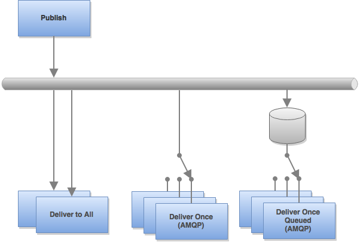

# msb - microservicebus [](https://travis-ci.org/tcdl/msb)

A framework to simplify the implementation of an event-bus oriented microservices architecture.

<!-- MarkdownTOC -->

- [Installation](#installation)
- [Usage](#usage)
  - [Pub/Sub](#pubsub)
  - [Request/Response](#requestresponse)
  - [Monitoring](#monitoring)
- [Configuration](#configuration)
  - [channelManager.configure(config)](#channelmanagerconfigureconfig)
  - [Environment Variables](#environment-variables)
- [Tools](#tools)
  - [CLI Listener](#cli-listener)
  - [CLI Monitor](#cli-monitor)
  - [Related Modules](#related-modules)
- [Message Brokers / Adapters](#message-brokers--adapters)
  - [Redis](#redis)
  - [AMQP / RabbitMQ](#amqp--rabbitmq)
- [API](#api)
  - [Class: msb.Responder](#class-msbresponder)
  - [Class: ResponderServer](#class-responderserver)
  - [Class: ResponderResponse](#class-responderresponse)
  - [Class: msb.Requester](#class-msbrequester)
  - [Class: msb.Collector](#class-msbcollector)
  - [Module: msb.request](#module-msbrequest)
  - [Module: msb.validateWithSchema](#module-msbvalidatewithschema)
  - [Channel Monitor](#channel-monitor)
  - [Channel Monitor Agent](#channel-monitor-agent)
  - [Channel Manager](#channel-manager)
  - [Producer](#producer)
  - [Consumer](#consumer)

<!-- /MarkdownTOC -->

## Installation

```
$ npm install msb --save
```

## Usage

```js
var msb = require('msb');
```

See [examples](example) of the patterns below.

### Pub/Sub

Every message-broker pattern in this module is based on one of these publish/subscribe patterns. Producers publish messages to a topic on the microservicebus, which gets delivered to subscribed consumers.



- Multiple producers can publish messages on the same topic.
- Producers have no control over how many times its messages are consumed.
- It is the responsibility of consuming services to define how they want to consume messages from a specific topic.
- You can combine different consumer patterns on a single topic.

#### Broadcast

The broadcaster should ensure their messages are formatted according to the [envelope schema](schema.js). A time-to-live (ttl) can be optionally provided to ensure messages cannot be delivered after this amount of milliseconds. (This value is sensitive to synchronisation of clocks between producers and consumers.) The payload should be provided as a JSON-serializable object.

```js
var message = messageFactory.createBroadcastMessage({
  namespace: 'test:pubsub',
  ttl: 30000 // Optional
})

message.payload = { /* ... */ }
```

The implementer should decide how they want to handle messages that cannot be delivered to the message broker, i.e. where an error is passed back.

```js
msb
.channelManager
.findOrCreateProducer('test:pubsub')
.publish(message, function(err) {
  if (err) return debug(err)

  //...
})
```

#### Deliver to All

All listeners will receive all messages published to this topic, as long as they are online at the time the message is published.

```js
msb
.channelManager
.findOrCreateConsumer('test:pubsub', { groupId: false })
.on('message', function(message) {
  //...
})
.on('error', debug)
```

#### Deliver Once (AMQP Only)

Only one listener will receive each message published to the specified topic.

##### Online Listeners Only

Listeners will only receive messages published while they are online.

```js
msb
.channelManager
.findOrCreateConsumer('test:pubsub', {
  groupId: 'example-string'
})
.on('message', function(message) {
  //...
})
.on('error', debug)
```

##### Queued While Offline

Listeners will also receive messages published while they were offline, queued up in the message broker. Messages that has a time-to-live (ttl) specified will not be delivered after this time has been exceeded.

Note that messages will only be queued from the first time this listener has been instantiated.

```js
msb
.channelManager
.findOrCreateConsumer('test:pubsub', {
  groupId: 'example-string',
  durable: true
})
.on('message', function(message) {
  //...
})
.on('error', debug)
```

### Request/Response

#### Request

##### 1-1

The simplest way to do a 1-1 request is to provide only a topic and a JSON-serializable payload. Should multiple responders attempt to respond, only the first response to be received will be provided to the callback.

```js
msb.request('example:topic', payload, function(err, payload, _fullMesssage) {
  if (err) return debug(err)

  //...
});
```

Additional settings can be provided:

```js
msb.request({
  namespace: 'example:topic',
  waitForResponsesMs: 1000
}, payload, function(err, payload, _fullMesssage) {
  if (err) return debug(err)

  //...
});
```

##### 1-n

A single payload is published with a return topic derived from the namespace that will ensure responses are received by this requester.

###### Timeout-based

The requester will listen for multiple responses for the specified amount of time.

```js
var requester = msb.Requester({
  namespace: 'example:topic',
  waitForResponsesMs: 10000 // a.k.a. responseTimeout
})

requester
.on('payload', function(payload, _fullMessage) {
  //...
})
.on('error', function(err) {
  debug(err)
})
.on('end', function() {
  //... Note: won't fire if the requester encountered an error
})
.publish(payload)
```

###### Number of Responses

The requester will 'end' once this number of responses have been received.

```js
var requester = msb.Requester({
  namespace: 'example:topic',
  waitForResponses: 1
})

//...
```

###### With Acks

Responders have the ability to change the expected number of responses or how long the requester should wait for responses from that responder. If you want to guarantee that the requester will wait for such messages (acks) to be received, you should specify a minimum time for the requester to wait.

```js
var requester = msb.Requester({
  namespace: 'example:topic',
  waitForAcksMs: 1000, // a.k.a. ackTimeout
  waitForResponses: 1
})

//...
```

In the above case, the requester will only ever end after the specified `waitForAcksMs`.

#### Response

##### 1-1

A single response (per responder) for each incoming request.

```js
msb.Responder.createServer({
  namespace: 'example:topic'
})
.use(function(request, response, next) {
  var body = {}

  response.writeHead(200) // HTTP-compatible
  response.end(body) // To be provided in response `payload.body`
})
.listen()
```

##### 1-ack+1 (Middleware-style Server Pattern)

An ack is sent to ensure the requester will continue to wait for this response.

```js
msb.Responder.createServer({
  namespace: 'example:topic'
})
.use(function(request, response, next) {
  var expectedResponses = 1
  var expectedTimeForResponse = 3000

  response.responder.sendAck(expectedResponses, expectedTimeForResponse, next)
})
.use(function(request, response, next) {
  var body = {}

  response.writeHead(200) // HTTP-compatible
  response.end(body) // To be provided in response `payload.body`
})
.listen()
```

##### 1-ack+n (Responder-Emitter Pattern)

An ack is sent to ensure the requester will wait for the multiple responses being prepared.

```js
msb.Responder.createEmitter({
  namespace: 'example:topic'
})
.on('responder', function(responder) {

  responder.sendAck(3, 5000)

  var i = 0;
  while (i++ < 3) {
    var payload = {
      body: {
        //...
      }
    }

    responder.send(payload, function(err) {
      if (err) return debug(err)
    })
  }
})
```

### Monitoring

The [Channel Monitor Agent](#channel-monitor-agent) reports the status of producer/consumer channels to all instances of [Channel Monitor](#channel-monitor). You should start the `channelMonitorAgent` in all services you wish to report from:

```js
msb.channelMonitorAgent.start()
```

The [CLI tools](#cli-listener) as well as the [archiver service](https://github.com/tcdl/es-archiver) are examples where a [Channel Monitor](#channel-monitor) is used for discovery of new channels.

## Configuration

### channelManager.configure(config)

Loads the provided config object over the configuration for the channelManager. E.g.

```js
msb.configure(config); // Default channelManager, or
msb.createChannelManager().configure(config); // Additional channelManager
```

*Note: It is recommended that you do not re-configure after publisher/subscriber channels have been created.*

### Environment Variables

- MSB_SERVICE_NAME The string used to identify the type of service, also used as the default for the broker groupId. (Default: `name` in the package.json of the main module.)
- MSB_SERVICE_VERSION (Default: `version` in the package.json of the main module.)
- MSB_SERVICE_INSTANCE_ID (Default: generated universally unique 12-byte/24-char hex string.)
- MSB_BROKER_ADAPTER One of 'redis', 'amqp' or 'local' (Default: 'redis')
- MSB_BROKER_HOST and MSB_BROKER_PORT Maps to appropriate values in `config.redis` and `config.amqp` overriding defaults.
- MSB_CONFIG_PATH Loads the JSON/JS file at this path over the base channelManager configuration. Similar to calling `channelManager.configure(config)` programmatically.

## Tools

### CLI Listener

Listens to a topic on the bus and prints JSON to stdout. By default it will also listen for response topics detected on messages, and JSON is pretty-printed. For [Newline-delimited JSON](http://en.wikipedia.org/wiki/Line_Delimited_JSON) compatibility, specify `-p false`.

```js
$ node_modules/msb/bin/msb -t topic:to:listen:to
```

Or if globally installed, i.e. `npm install msb -g`:

```
$ msb -t topic:to:listen:to
```

Options:
- **--topic** or **-t**
- **--follow** or **-f** listen for following topics, empty to disable (Default: response)
- **--pretty** or **-p** set to false to use as a newline-delimited json stream, (Default: true)

### CLI Monitor

The CLI monitoring tool can be run for a globally installed MSB, by running:

```
$ node_modules/msb/bin/msb-monitor
```

Or if globally installed, i.e. `npm install msb -g`:

```
$ msb-monitor
```

Producing a table such as:

```
┌──────────────────────────────────┬──────┬───────────────┬──────┬───────────────┐
│ Topic                            │ Prod │ Last Produced │ Cons │ Last Consumed │
├──────────────────────────────────┼──────┼───────────────┼──────┼───────────────┤
│ example:topic                    │ 2    │ just now      │ 0    │ just now      │
│ example:topic:response:3cb35cdb… │ 2    │ just now      │ 0    │ just now      │
│ example:topic:response:3cb35cdb… │ 2    │ just now      │ 0    │ just now      │
└──────────────────────────────────┴──────┴───────────────┴──────┴───────────────┘
```

### Related Modules

- [http2bus](https://github.com/tcdl/msb-http2bus) Provides HTTP endpoints for services exposed through the bus.
- [bus2http](https://github.com/tcdl/msb-bus2http) Exposes HTTP endpoints through the bus.
- [bus2aws](https://github.com/tcdl/msb-bus2aws) Generic adapter to send messages from the bus to AWS services.
- [es-archiver](https://github.com/tcdl/msb-proxies) Archives all messages to Elasticsearch.
- [msb-java](https://github.com/tcdl/msb-java) Java API

## Message Brokers / Adapters

### Redis

Redis Pub/Sub is the default message broker used. Setup of Redis is practically effortless on most platforms, making it great for development. Redis Pub/Sub is limited in that all published messages will be received by all subscribers per topic. This means that services backed by Redis will not scale out horizontally, i.e. you cannot distribute the work over multiple processes.

### AMQP / RabbitMQ

The AMQP adapter is tested with RabbitMQ and it implements a limited topology for simplification. One exchange is created per topic and a queue is created for every group of similar services, configured using a groupId. This means that you can have different types of services listening on the same topic, and multiple processes of the same type of service would receive a fair distribution of messages.

## API

### Class: msb.Responder

A responder lets you send of formatted acks and responses in response to a request message received on a topic/namespace.

#### responder.sendAck([timeoutMs][, responsesRemaining], cb)

- **timeoutMs** (optional) The requester should wait until at least this amount of milliseconds has passed since the request was published before ending. (Default: previously set value or the default timeout on the requester.)
- **responsesRemaining** (optional) A positive value increases the amount of responses the requester should wait for from this responder. A negative value reduces the amount of the responses the requester should wait for from this responder. Default: 1
- **cb** (optional) cb(err) Function that is called after transmission has completed.

#### responder.send(payload[, cb])

- **payload** An object that can be converted to JSON.
- **cb** (optional) cb(err) Function that is called after transmission has completed.

#### responder.originalMessage

The request message this responder is responding to.

#### Responder.createEmitter(options, [channelManager])

- **options.namespace** String topic name to listen on for messages.
- **options.groupId** Optional See [channelManager.findOrCreateConsumer](#channelManager-findOrCreateConsumer)
- **channelManager** Optional channelManager. (Default: `msb.channelManager`)

#### Responder.createServer([options])

See [ResponderServer](#new-responderserveroptions) for options.

### Class: ResponderServer

#### new ResponderServer(options)

- **options.namespace** String topic name to listen on for requests.
- **options.tags** Array of Strings Add these tags to responses.
- **options.responseChannelTimeoutMs** Optional Number of milliseconds for the producer channel to be kept after the last publish. (Default: 15 * 60000/15 minutes)
- **options.groupId** Optional See [channelManager.findOrCreateConsumer](#channelManager-findOrCreateConsumer)

(Use `msb.Responder.createServer()` to create instances.)

#### responderServer.use(fnOrArr)

- **fnOrArr** Function or Array of middleware-like functions with signature:

`function handler(request, response, next)`
- **request** The payload on the incoming message.
- **response** [ResponderResponse](#class-responderresponse) object.
- **next** Function To call if response was not fulfilled, with an error object where an error occurred.

`function errorHandler(err, request, response, next)`
- **err** Error Passed to a previous `next()` call.
- **request**, **response**, **next** as above.

#### responderServer.listen([channelManager])

Call this to start listening for requests.

- **channelManager** Optional channelManager. (Default: `msb.channelManager`)

### Class: ResponderResponse

Passed to [ResponderServer](#new-responderserveroptions) middelware-like functions. The interface is kept similar to core HttpServerResponse for convenience.

#### response.setHeader(name, value)<br/>response.getHeader(name)<br/>response.removeHeader(name)

See [http](https://nodejs.org/api/http.html#http_class_http_serverresponse).

#### response.writeHead(statusCode[, statusMessage][, headers])

- **statusCode** Number Corresponding HTTP status code.
- **statusMessage** String Corresponding HTTP status message.
- **headers** Object

#### response.end([body][, cb])

- **body** Optional String|Object|Buffer
- **cb** Optional Function Callback to be called when response has been successfully sent or on error.

#### response.responder

The Responder object used to send acks and responses.

### Class: msb.Requester

An requester is a collector component that can also publish new messages on the bus.

#### new Requester(options[, originalMessage])

- **options.namespace** String Publish request message on this topic and listen on this appended by ':response'.
- **options.tags** Array of Strings Add these tags to the published message.
- **options.waitForAcksMs** Optional Will wait at least this amount of ms for acks, before ending.
- **options.waitForResponsesMs** Optional Will wait at least this amount of ms to receive the expected number of responses, before ending. (Default: 3000).
- **options.waitForResponses** Optional Number of responses the collector expects before either ending or timing out. (Default: Infinity/-1, i.e. only end on timeout. You will typically set this to 1.)
- **options.requestChannelTimeoutMs** Number of milliseconds for the producer channel to be kept after the request is published. (Default: 15 * 60000/15 minutes)
- **originalMessage** Optional (Object|null) Message this request should inherit tags from. Explicitly specify `null` to prevent inheritance from the current `messageFactory` context.

#### requester.publish([payload][, cb])

- payload Object Contains typical payload.
- cb Function Callback to be called on success or error.

#### Event: 'response'

`function(payload, _message) { }`

- **payload** Object Response message payload.
- **_message** Object The full response message. In most cases it should not be needed.

#### Event: 'ack'

`function(ack, _message) { }`

- **ack** Object Response message ack.
- **_message** Object The full ack-containing message. In most cases it should not be needed.

#### Event: 'end'

Emitted either on timeout or when the expected number of responses has been received.

### Class: msb.Collector

A collector is a component that listens for multiple response messages, with timeouts and number of responses determining its lifetime.

(For events and instantiation, see [Requester](#new-requesteroptions-originalmessage).)

### Module: msb.request

A simpler API for 1-1 request/responses.

#### msb.request(options, payload, cb)<br/>msb.request(namespace, payload, cb)

- **options** Object See [Requester](#new-requesteroptions-originalmessage) common options.
- **namespace** or **options.namespace** String The namespace to send the request on.
- **options.responseSchema** [JSON schema](http://json-schema.org) schema object, describing the expected response payload.
- **options.channelManager** Optional Alternative [channelManager](#channel-manager) to use.
- **options.originalMessage** Optional See [originalMessage](#new-requesteroptions-originalmessage) provided to Requesters.

### Module: msb.validateWithSchema

#### msb.validateWithSchema(schema, message)

A function that throws a validation error if the message does not validate.

- **schema** [JSON schema](http://json-schema.org) schema object.
- **message** The message to be validated.

#### middleware(payloadSchema)

Returns a middleware-style function, e.g. `function(request, response, next) { }`, to be used in a [ResponderServer](#new-responderserveroptions) middleware chain, that will pass a validation error to `next()` for invalid incoming requests.

- **payloadSchema** [JSON schema](http://json-schema.org) schema object, describing the incoming `request`.

E.g. `responderServer.use(msb.validateWithSchema.middleware(payloadSchema));`

#### onEvent(schema, successFn[, errorFn])

Returns an event handler function, e.g. `function(payload) { ... }`.

- **schema** [JSON schema](http://json-schema.org) schema object, describing the incoming event message.
- **successFn** Function `function(payload) { }` An event handler that will only be called if the incoming payload validates.
- **errorFn** Optional Function `function(err, payload) { }` A function that will be called with the validation error and original payload if the incoming message fails validation.

Note: Without an `errorEventHandlerFn`, errors will be emitted on the original event emitter.

E.g.

```js
  requester
  .on(msb.validateWithSchema.onEvent(messageSchema, function(payload) {
    ...
  }))
  .on('error', function(err, payload) {
    console.error(err);
    requester.end();
  }));
```
### Channel Monitor

A channel monitor sends heartbeats and listens for information on producers and consumers on remote `channelManager` instances.

```js
var channelMonitor = msb.channelMonitor; // Default channelManager monitor, or
var channelMonitor = channelManager.monitor; // Additional channelManager monitor
```

#### channelMonitor.start()

Starts sending heartbeats and listening.

#### Event: 'update'

`function(doc) { }`

- **doc** Object
- **doc.infoByTopic** Object with topics as keys with objects as values e.g.

```js
{
  consumers: ['remoteInstanceId'],
  producers: ['remoteInstanceId'],
  consumedCount: 0,
  producedCount: 0,
  lastProducedAt: Tue Mar 31 2015 11:11:35 GMT+0100 (BST),
  lastConsumedAt: Tue Mar 31 2015 11:11:35 GMT+0100 (BST)
}
```

- **doc.serviceDetailsById** Object with instance IDs as keys with objects containing the remote `config.serviceDetails`.

#### Event: 'heartbeat'

Emitted when a new heartbeat has started.

### Channel Monitor Agent

```js
var channelMonitorAgent = msb.channelMonitorAgent; // Default channelManager monitoring agent, or
var channelMonitorAgent = channelManager.monitorAgent; // Additional channelManager monitoring agent
```

#### channelMonitorAgent.start()

Starts publishing information about the producers and consumers created on the `channelManager`, and responds to heartbeats.

### Channel Manager

The channel manager enables re-use of channels listening/publishing per topic. It is an EventEmitter instance used as a singleton with the app-wide configuration.

```js
var channelManager = msb.channelManager;
```

#### channelManager.findOrCreateProducer(topic)

Returns a producer for this topic. Either existing or new. Corresponding `channelManager` events will be emitted for this producer.

#### channelManager.findOrCreateConsumer(topic[, options])

Returns a consumer listening on this topic. Either existing or new. Corresponding channelManager events will be emitted for this consumer. If `config.cleanupConsumers` is set, these consumers will be removed as soon as there are no more listeners for them. If an app-wide schema exists, it will be checked for every incoming message.

- **topic** String
- **options.groupId** String Custom group identifier for round-robin message queue.
- **options.groupId** Boolean Set to `false` for broadcast-style message queue.

#### Event: 'newProducerOnTopic'

- **topic** The name of the topic a new producer has been created for.

#### Event: 'newProducedMessage'

- **topic** The name of the topic a message has been successfully published for

#### Event: 'newConsumerOnTopic'

- **topic** The name of the topic a new producer has been created for.

#### Event: 'removedConsumerOnTopic'

- **topic** The name of the topic a new producer has been created for.

#### Event: 'newConsumedMessage'

- **topic** The name of the topic a message has been successfully published for.

### Producer

(Created using the `channelManager.findOrCreateProducer`.)

#### producer.publish(message, cb)

- **message** Either a string or an object that will be converted to JSON.
- **cb** cb(err) Function that is called after transmission has completed.

### Consumer

(Created using the `channelManager.findOrCreateConsumer`.)

#### consumer.close()

Stops listening for messages on this topic. If `config.cleanupConsumers` is set, and this consumer was created using `channelManager.findOrCreateConsumer`, it would be removed from the `channelManager`.

#### Event: 'message'

- **message** a parsed object, validated using the app-wide `config.schema`.

#### Event: 'error'

- **error** Either an error emitted by the underlying driver, or a schema validation error.
